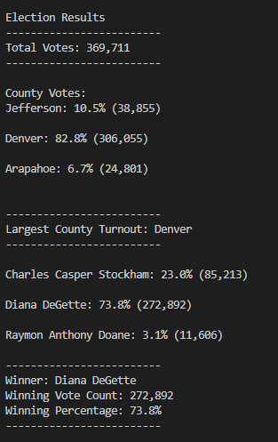
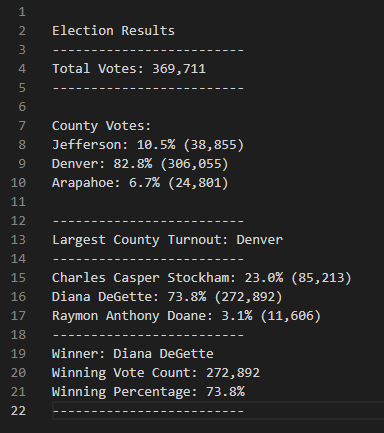

# Election Analysis

## Project Overview

### Purpose
To use python to make an analysis of a dataset(.csv) of election results and printing the result to the terminal and a text file by using
- for loops
- if statements
- csv.reader
- .write
- etc.

### Background
A Colorado Board of Elections employeee has given you the following tasks to complete the election audit of a recent local congressional election.
1. Calculate the total number of votes cast.
2. Get a complete list of candidates who recieved votes.
3. Calculate the total number of votes each candidate recieved.
4. Calculate the percentage of votes each candidate won.
5. Determine the winner of the election based on popular vote.

## Resources
- Data Source: election_results.csv
- Software: Python 3.7.6, Visual Studio Code 1.70.2

## Results

 

The analysis of the election show that:

- There were **369,711** votes cast in the election

- The County Breakdown was:
  - Jefferson recieved **10.5%** of the vote and **38,855** votes total.
  - Denver recieved **82.8%** of the vote and **306,055** votes total.
  - Arapahoe recieved **6.7%** of the vote and **24,801** votes total.

- Largest county Turnout was **Denver** with **306,055** votes.
 
- The candidate results were:
  - Charles Casper Stockham recieved **23%** of the vote and **85,213** votes total.
  - Diana DeGette recieved **73.8%** of the vote and **272,892** votes total.
  - Raymon Anthony Doane recieved **3.1%** of the vote and **11,606** votes total.

- The winner of the election was:
  - **Diana DeGette**, who recieved **73.8%** of the vote and **272,892** votes total.
 
## Summary
k
